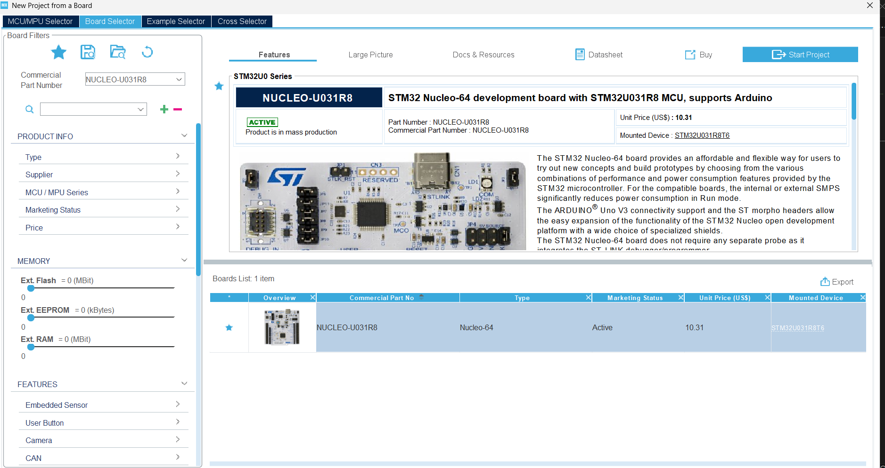
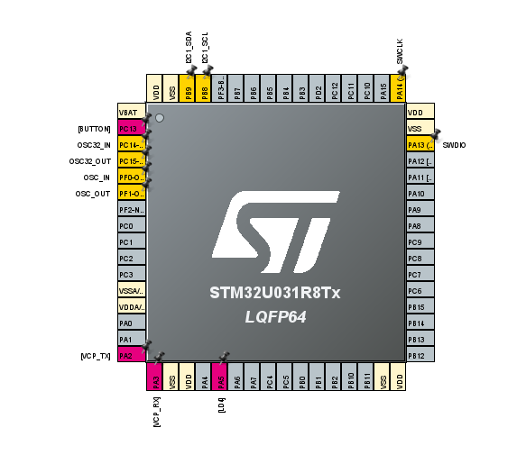
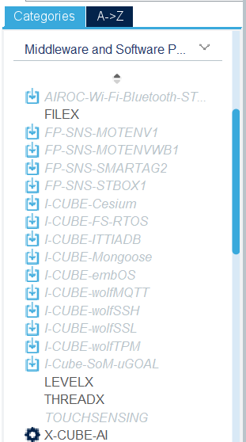

# TinyML-STM32
TMNIST Model Deployment on STM32

This repository demonstrates how to:

1. Train a TensorFlow model on the TMNIST dataset.
2. Quantize the model to TensorFlow Lite.
3. Convert the `.tflite` model into a C array.
4. Deploy the model to an STM32 microcontroller using VS Code (no PlatformIO).

---

## 📁 Folder Structure

project/

├── train_tmnist.py # Trains, quantizes, and saves the model in TFLite format

├── convert_to_c_array.py # Converts .tflite to C array (.cc file)

├── tmnist_model/ # SavedModel directory

├── tmnist_quant.tflite # Quantized model

├── model_data.cc # TFLite model as a C array

└── README.md

## Step 1: Train the Model

Install dependencies:
```bash
pip install tensorflow numpy
```
### Script : train_nmist.py
1. Trains a model on the TMNIST dataset.

2. Saves in a regular (float32) TFLite model
 
```python
converter = tf.lite.TFLiteConverter.from_keras_model(model)
tflite_model = converter.convert()
```
❗Important❗
Make sure to have the correct path to your csv data file 
```python
x, y = load_tmnist("C:\\Users\\jcuen\\Downloads\\archive (1)\\tmnist.csv") # add the path to your file
```

3. Apply quantization

```python
converter.optimizations = [tf.lite.Optimize.DEFAULT]
converter.representative_dataset = representative_dataset
converter.target_spec.supported_ops = [tf.lite.OpsSet.TFLITE_BUILTINS_INT8]
converter.inference_input_type = tf.int8
converter.inference_output_type = tf.int8
quantized_tflite_model = converter.convert()

```
4. Output 
- tmnist_model.tflite → float32

- mnist_quantized.tflite → fully quantized int8 model

5. Convert to a C Array

This creates a C++ source file (model_data.cc) that you can compile into your STM32.

```bash
xxd -i tmnist_quant.tflite > model_data.cc
```

If you are on Windows you can use the **convert_to_c_array.py** file and run the following command:

```bash
python convert_to_c_array.py
```

## 🔌 Step 2: Deploy on STM32 with VS Code

### 🧩 Setup STM32 Project

Use **STM32CubeMX** to:

**Create a new project**

In this example the board being used is **STM32: NUCLEO-U031R8**

**1:** Pick your board in **Board Selector**

 

**2:** Keep default pinout configuration 
 

**3:** Make sure to have **X-CUBE-AI** as part of your [**Software Packages**](https://www.st.com/en/embedded-software/x-cube-ai.html)

 

**4:** Click on **Generate Code** button and name the project

### Step 4: Drop into STM32 Project (CubeIDE)
1. Create a folder in your STM32 project called Core/Src/ (or wherever your .c/.cpp files go).

2. Add model_data.cc there.

3. In your main.c or main.cpp, you can reference:

```c
extern const unsigned char tmnist_quant_tflite[];
extern const int tmnist_quant_tflite_len;
```

### Troubleshooting:

❗ Conversion Error:
Double-check model_data.cc is formatted as a valid C array.

### Resources:

STM32CubeMX Documentation (ST):
https://www.st.com/en/development-tools/stm32cubemx.html

Using VS Code for STM32 Development (ST Blog & Tutorials):
STM32 in Visual Studio Code: Setup & Debugging Guide
https://www.st.com/resource/en/user_manual/um2576-getting-started-with-stm32cubemx-for-vscode-stmicroelectronics.pdf


